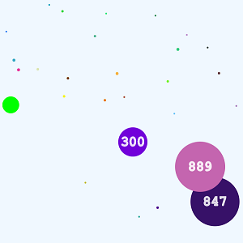
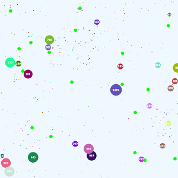

# Cells Merge
_Inspiration and feature set  of [Agar.io](https://en.wikipedia.org/wiki/Agar.io)_
>Players control one or more cells where the goal is to gain as much mass as possible by eating pellets and cells smaller than the player's cell while avoiding larger ones which can eat the player's cells.

Player's cell in purple @ 300 size

Map of all cells

Displaying each cell's current target

Debug panel showing all cells and attributes

## Features
Canvas implementation with only kd-tree project as a dependency, featuring:
* Controllable cell
  - Mouse direction to move
  - Spacebar to split
* Computer controlled enemy cells
* Randomly generated pellets to consume
* Virus spikes which cause splitting
* Debug canvas panel to show game state and entity data
* Additional settings to:
  - P = Pause Game, continue draw but disable update
  - T = Targets Display, show where computer entities are heading
  - S = Scaled Draw, toggle zoom based on size or show entire map
